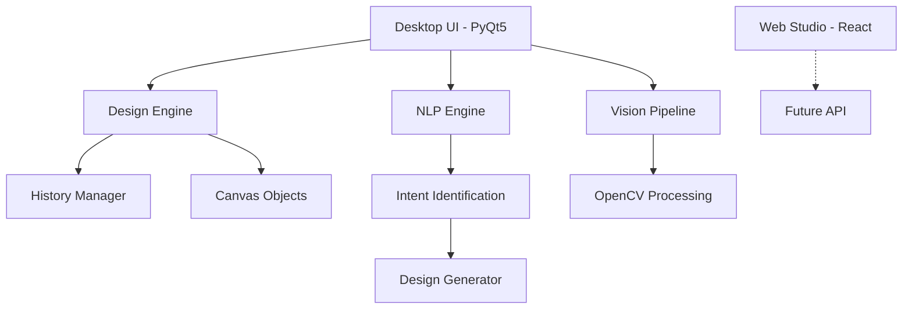

# Technical Architecture

VisionStudioAI is built with a modular architecture that separates concerns between state management, logic, and presentation.

## System Overview

## Module Breakdown

### `core/`
The heartbeat of the application.
- `engine.py`: Manages the list of canvas elements, selection state, and event signaling.
- `history.py`: Implements the Memento pattern for robust undo/redo functionality.
- `objects.py`: Base classes for all renderable elements (Text, Image, Shape).

### `nlp/`
The intelligence layer.
- `parser.py`: Uses regex and keyword matching to identify design requests.
- `ai_reasoning.py`: Maps high-level styles (e.g., "Luxury") to low-level design actions.
- `intent.py`: Coordinates the generation of elements based on parsed intent.

### `vision/`
The image processing powerhouse.
- `filters.py`: Wrappers for OpenCV functions like Grayscale, Blur, and Canny.
- `image_tools.py`: Utility functions for resizing, cropping, and blending.

### `ui/`
The presentation layer.
- `canvas.py`: Custom QWidget that handles rendering, mouse interactions, and coordinate transformations.
- `styles.py`: Defines the "Global Style" (QSS) that gives the app its modern dark look.
